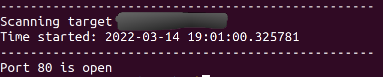

# Ports Scanner by IP

## About
It will give you the list of open ports like below



## Pre-reqs
- Install [Python](https://www.python.org/)

## Getting started
- Clone the repository
```
git clone https://github.com/salmantec/port_scanner.git
```
- Changes (if needed)
```
If you want to scan some other ports, you can change the range in line no 19
```
- Start the script
```
python3 scanner.py <ip>
```
